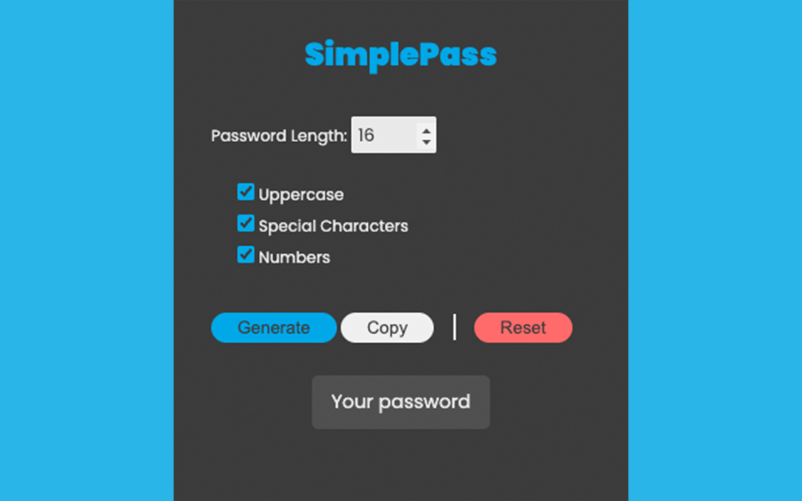

Chrome extension to make quick and easy passwords. This extention takes out a few letters that can ge confused if you need to type in manually. There are no:

Lowercase
- i, l

Uppercase
- I, L, O

Number
- 1, 0

 
